# Awesome Enterprise Content Discovery 🔍 Enterprise Search & Knowledge Discovery Stack

   

> **Curated List of SaaS Platforms & Open-Source GitHub Projects**
> 
> *Focused on Enterprise Search, Federated Search, AI Knowledge Discovery, Permission-Aware Retrieval & Retrieval-Augmented Generation (RAG)* 🚀
> 
> **Last updated: October 2026** 📅

---

## 📌 Overview & Industry Relevance

This repository tracks top-tier **SaaS platforms** ☁️ and **open-source projects** 🔓 for **Enterprise Content Discovery**, **Internal Knowledge Search**, and **Federated RAG**. These tools enable employees and IT teams to instantly locate documents, surface context-aware answers, and execute knowledge retrieval across fragmented workplace silos—SharePoint, Confluence, Google Drive, Slack, Notion, Jira, databases, and enterprise APIs.

### 🌟 Key Categories & Market Leaders
* **Commercial Enterprise SaaS**: Microsoft Delve, Glean, Coveo, Sinequa, Lucidworks Fusion, Elastic Enterprise Search, Algolia, Guru, BA Insight.
* **Open-Source Production Alternatives**: Onyx (formerly Danswer), SWIRL Community, DocsGPT, Fess, Turing CE, Datafari, OpenBeam, Gerev, Omo, Redrob Recall.

---

## 📖 Table of Contents 🧭

- [☁️ SaaS/Hosted Platforms](#-saas-hosted-platforms)
- [🔓 Open-Source GitHub Projects](#-open-source-github-projects)
- [🛠️ Developer Tools & Engines](#️-developer-tools--search-engines)
- [🤝 How to Contribute](#-how-to-contribute)
- [💖 Support & Sponsorship](#-support--sponsorship)
- [⚠️ Disclaimer](#-disclaimer)
- [⭐ Star History](#-star-history)

---

## ☁️ SaaS/Hosted Platforms

> **📊 Market Context & Fragmentation**: The global enterprise search and content discovery software market is estimated at **~$8B in 2026** and is projected to expand to **~$20B by 2032** (CAGR ~16%). The sector is **moderately fragmented** — **Microsoft Delve** leverages Microsoft 365 ecosystem distribution, **Glean** leads the AI-native enterprise assistant tier with a **$7.2B valuation**, **Algolia** and **Elastic** dominate high-throughput API & developer search, while traditional category leaders like **Coveo**, **Sinequa**, and **Lucidworks** serve large-scale enterprise deployments. No single vendor holds a winner-take-all position; organizations frequently deploy hybrid multi-vendor stacks.

| Platform | Description | Company Size (Revenue / Valuation) 📈 | Pricing (Starting Tier) 💳 | Free Tier Limits 🎁 |
|:---|:---|:---|:---|:---|
| **[Microsoft Delve](https://www.microsoft.com/en-us/microsoft-365/delve)** | **Microsoft's content discovery tool.** Surfaces relevant documents and colleagues based on Microsoft Graph signals. | **~$281B revenue** (Microsoft FY2025) | **$8.25/user/month** (M365 Business Standard) or **$23/user/month** (Enterprise E3). | **Included with Microsoft 365** subscription; **30-day free trial** available. |
| **[Glean](https://www.glean.com/)** | **AI-native enterprise search and work assistant.** 100+ connectors, Enterprise Knowledge Graph, permission-aware retrieval, and AI agents. | **$7.2B valuation** ($600M+ raised) | Enterprise contracts from **$35–$75/user/month** (est. **$25k–$60k annual min**). | **No free tier**. Custom sandbox & interactive demo upon sales request. |
| **[Algolia](https://www.algolia.com/)** | **Search and discovery API.** Sub-50ms response times, NeuralSearch, and Recommend. | **~$2.25B valuation** (Private est.) | **$0/month base** ($0.50 per 1,000 additional search requests on Grow plan). | **10,000 search requests/month** & **100,000 records** on free Build plan. |
| **[Elastic Enterprise Search](https://www.elastic.co/enterprise-search)** | **Elastic's enterprise search suite.** App Search, Workplace Search, and Site Search. | **~$1.5B revenue** (Public: ESTC) | **$95/month** (Standard Cloud deployment starting tier) or **$109/month** (Platinum). | **Free Basic tier** (self-managed) with core search; **14-day free trial** on Cloud. |
| **[Coveo](https://www.coveo.com/)** | **AI-powered relevance platform.** Relevance Generative AI for synthesized answers with citations, Case Assist AI for support deflection. | **~$200M+ revenue est.** (Public: CVO) | Enterprise quotes starting from **~$10,000–$20,000/month** (annual contract basis). | **No free tier**. 30-day sandbox environment upon sales request. |
| **[Sinequa](https://www.sinequa.com/)** | **Enterprise search and analytics platform.** Natural language processing, machine learning, and 200+ connectors. | **~$100M+ revenue est.** (Private) | Enterprise license multi-year contract starting at **~$100,000+/year**. | **No free tier**. Proof-of-Concept (PoC) environment during sales evaluation. |
| **[Lucidworks Fusion](https://lucidworks.com/)** | **AI-powered search platform.** Connectors, relevance tuning, and RAG capabilities. | **~$100M+ raised** (Private) | Enterprise subscription starting at **~$3,000–$10,000/month** (annual contract). | **No free tier**. Custom sandbox test environment available upon request. |
| **[Guru](https://www.getguru.com/)** | **AI-powered knowledge management.** Verified answers surfaced in Slack, browser, and other tools. | **~$100M+ raised** (Private) | **$15/user/month** (Builder plan starting tier) or **$25/user/month** (Enterprise). | **30-day free trial** with full AI knowledge features; no permanent free plan. |
| **[BA Insight](https://www.bainsight.com/)** | **Enterprise search and AI platform.** Connectors for Microsoft 365, Salesforce, and more. | **Private** | Enterprise software license starting at **~$15,000/year** (connector bundles). | **No free tier**. Guided demo and sandbox evaluation available upon request. |
| **[Swiftype](https://swiftype.com/)** | **Site search and enterprise search (acquired by Elastic).** Now integrated into Elastic Enterprise Search. | **Part of Elastic** | **$79/month** (legacy Site Search starting tier) or bundled with **Elastic Cloud ($95/mo)**. | **14-day free trial** available for legacy site search functionality. |

---

## 🔓 Open-Source GitHub Projects

> **💡 Open-Source Ecosystem**: The open-source enterprise search stack is **production-proven and mature**. Self-hosted systems provide complete **data sovereignty**, **permission enforcement**, and zero per-seat licensing fees.

*Sorted by GitHub Star Count (Descending)* 🌟

| Repo | Description | Stars 🌟 |
|:---|:---|:---:|
| **[DocsGPT](https://github.com/arc53/DocsGPT)** | **Open-source AI platform for private RAG pipelines & document search.** Connects internal documents (PDF, RST, TXT, MD) and cloud storage to custom LLM search interfaces. Apache-2.0. |  |
| **[Onyx (formerly Danswer)](https://github.com/onyx-dot-app/onyx)** | **The closest open-source alternative to Glean.** Self-hosted internal search across **40+ connectors** (Salesforce, GitHub, Google Drive, Confluence, Slack, Notion). Permission-aware retrieval, generated answers with citations. MIT licensed. |  |
| **[Gerev](https://github.com/GerevAI/gerev)** | **AI-powered workplace search engine.** Connects Confluence, Google Drive, Slack, and Jira to deliver natural language answers with source linking. Apache-2.0. |  |
| **[SWIRL Community](https://github.com/swirlai/swirl-search)** | **Federated AI search and RAG without moving your data.** Queries 100+ sources live using native user permissions—no vector DB required, no ETL. Cosine vector re-ranking and real-time RAG citations. Apache-2.0. |  |
| **[Fess](https://github.com/codelibs/fess)** | **Open-source enterprise search server built on OpenSearch.** Crawls web, file systems, databases, and cloud services (SharePoint, Office 365, Box, Jira, Slack). Full-text faceting & RBAC filtering. Apache-2.0. |  |
| **[OpenBeam](https://github.com/kuluruvineeth/openbeam)** | **Open-source Glean for SaaS & physical systems.** 87 connectors including Slack, Notion, GitHub, plus IoT (Samsara, AWS IoT) & industrial protocols (MQTT, OPC-UA). Sub-200ms p99 latency & MCP server support. AGPLv3. |  |
| **[Datafari](https://github.com/francelabs/datafari)** | **Intelligent enterprise search engine.** Combines Apache ManifoldCF connectors, OpenSearch indexing, keyword/semantic hybrid search, and RAG document conversation mode. Apache-2.0. |  |
| **[Turing CE (Viglet)](https://github.com/openviglet/turing-ce)** | **Apache-2.0 alternative to Algolia and Coveo.** Faceted semantic search, hybrid BM25+vector ranking with Reciprocal Rank Fusion, RAG chat, and MCP tools. Connects Adobe AEM, WordPress, DBs, and files. |  |
| **[Omo](https://github.com/omo-ai/omo)** | **AI-native enterprise search engine.** LLM and vector store agnostic (GPT-4, Claude, Llama 3, Gemini). Declarative YAML pipelines for Google Drive, Notion, Confluence, Slack. Apache-2.0. |  |
| **[Hister](https://github.com/asciimoo/hister)** | **Private full-content search index.** Self-hosted webpage & document indexer with browser extension, local folder watcher, full-text filters, and MCP server. AGPLv3. |  |
| **[Redrob Recall](https://github.com/redrob-labs/redrob-recall)** | **Local-first desktop search app.** Everything stays on device—indexes local folders (PDF, DOCX, TXT, CSV, JSON) with hybrid semantic + FTS retrieval. Built with Tauri 2 + Qdrant Edge. |  |

---

## 🛠️ Developer Tools & Search Engines

Additional tools and search infrastructure commonly used to build custom enterprise search pipelines:

* **[Elasticsearch](https://github.com/elastic/elasticsearch)** — Industry-standard distributed search engine for vector and full-text retrieval.
* **[OpenSearch](https://github.com/opensearch-project/OpenSearch)** — Community-driven, open-source search and analytics suite.
* **[Meilisearch](https://github.com/meilisearch/meilisearch)** — Ultra-fast, typo-tolerant search engine API.
* **[DocFetcher](https://docfetcher.sourceforge.io/)** — Cross-platform desktop application for searching local document contents.
* **[lazylens](https://pypi.org/project/lazylens/)** — Terminal TUI lens over Confluence, Jira, and local files.

---

## 🤝 How to Contribute 🛠️

Contributions are welcome and appreciated! Follow these steps to submit additions:

1. 🍴 **Fork** this repository.
2. 📝 **Add/edit** entries in `README.md` following the exact table structure.
3. 🔗 Include: Name, repository/website link, concise description, pricing/star metrics, and company size details.
4. 🚀 Submit a **Pull Request** with a clear explanation of your additions.

---

## 💖 Support & Sponsorship ☕

If this curated catalog helps your enterprise research or development stack, please consider supporting the project!

- ⭐ **Star** this repository on GitHub.
- 🔄 **Share** it with fellow IT admins, software architects, and engineering leaders.
- ☕ **Sponsor / Buy a Coffee**: Consider supporting ongoing open-source curation via [GitHub Sponsors](https://github.com/sponsors/ishandutta2007).

Thank you for supporting open-source software! 🙏

---

## ⚠️ Disclaimer 📜

* This is a **community-curated resource** for informational purposes and does not constitute an endorsement.
* Enterprise content discovery platforms process sensitive internal knowledge; always verify security posture, SOC2/ISO compliance, and permission controls before deployment.
* **Open-Source Operations Note**: Self-hosting enterprise search replaces SaaS license fees with internal maintenance responsibility—including connector updates, access token rotation, and identity mapping.

---

## ⭐️ Star History

---

**Made for IT Administrators, Knowledge Managers, DevEx Teams, and Enterprise Architects.**  
*Let's make enterprise content discovery more open, transparent, and accessible.* ✨
